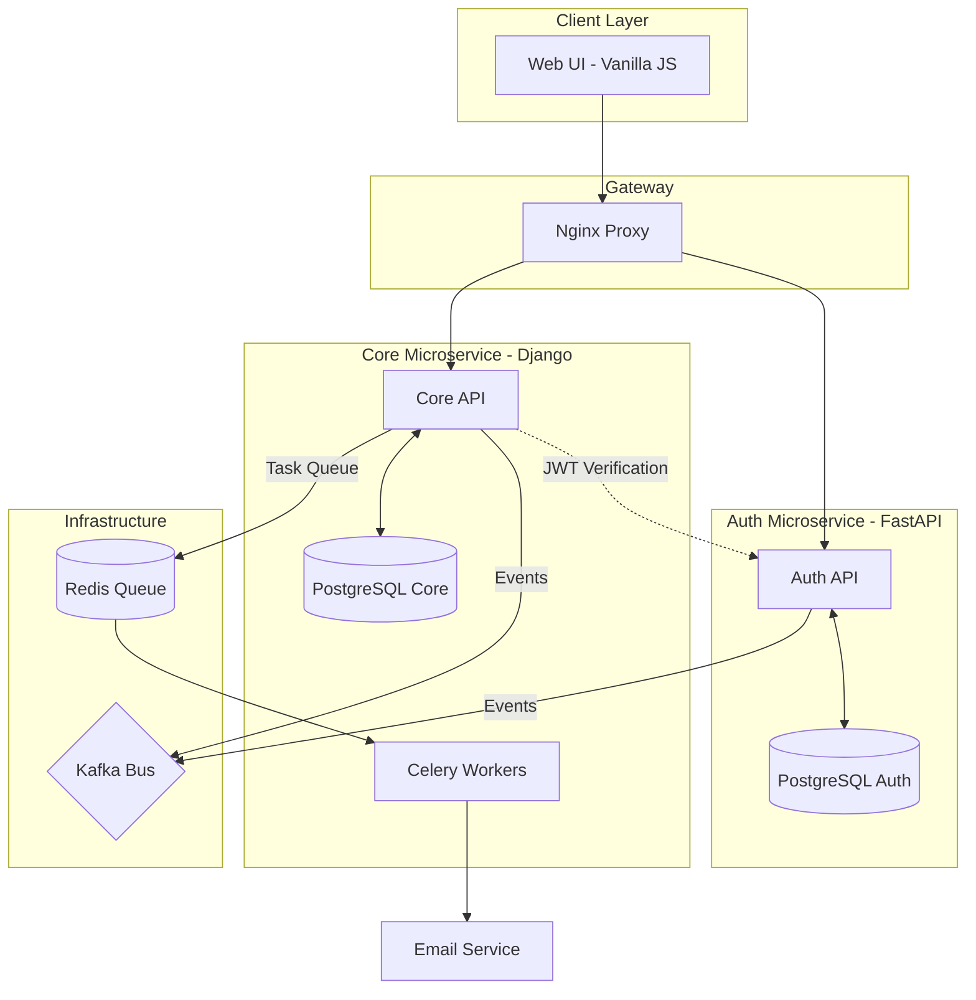
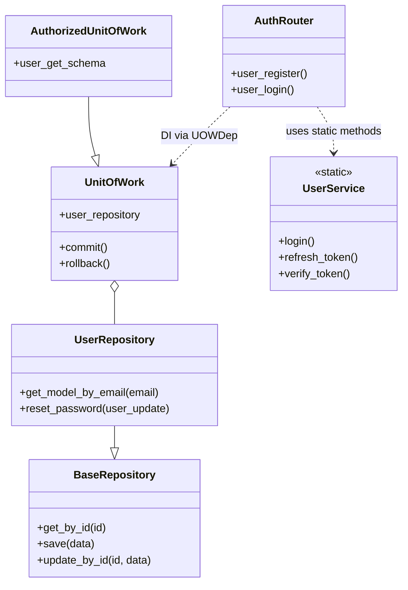

## Часть 1. Проектирование архитектуры ("To Be" — Как должно быть)

Описываем целевое состояние системы управления задачами.

1.  **Тип приложения:** Микросервисная архитектура (Distributed Microservices). Система разделена на независимые сервисы:
    *   **Auth Service:** Отвечает только за пользователей и безопасность.
    *   **Core Service:** Отвечает за бизнес-логику проектов и задач.
2.  **Стратегия развертывания:** Контейнеризированная Распределенная (Docker Compose). 
    *   *Обоснование:* Каждый сервис (Auth, Core, Postgres, Redis, Kafka) изолирован. Это позволяет масштабировать, например, только воркеры Celery или только API аутентификации в зависимости от нагрузки.
3.  **Обоснование выбора технологий:**
    *   **FastAPI:** Для сервиса Auth — высокая скорость обработки асинхронных запросов, встроенная поддержка OAuth2/JWT.
    *   **Django (DRF):** Для Core — богатая экосистема, мощная ORM и готовая админ-панель для управления данными.
    *   **Kafka:** Шина событий для асинхронной связи между сервисами (например, уведомление Auth-сервиса о действиях в Core).
    *   **Redis + Celery:** Обработка тяжелых фоновых задач (отправка email-отчетов) без блокировки основного потока.
4.  **Показатели качества:**
    *   *Security:* Использование JWT (Access/Refresh tokens) для безопасного взаимодействия между фронтендом и бэкендами.
    *   *Scalability:* Возможность горизонтального масштабирования микросервисов.
    *   *Maintainability:* Четкое разделение на слои (Repository, Unit of Work, Service Layer).
5.  **Сквозная функциональность (Cross-cutting functionality):**
    *   **Dependency Injection:** Использование `dependency_injector` в Django для управления зависимостями.
    *   **Event Logging:** Отправка событий в Kafka при создании/изменении объектов.
    *   **Global Exception Handling:** Единая обработка HTTP-ошибок через кастомные middleware и exception handlers.

### 6. Структурная схема (To Be)

---

## Часть 2. Анализ архитектуры ("As Is" — Как реализовано сейчас)

Проект реализован с использованием профессиональных паттернов проектирования, разделяющих логику работы с данными и бизнес-логику.

**Диаграмма классов/модулей (As Is) на примере Auth Service:**

*   **Auth Service:** Использует паттерн **Repository** для абстракции БД и **Unit of Work** для управления транзакциями.
*   **Core Service:** Использует **Dependency Injection** для интеграции `EventService` и **ViewSets** для быстрой реализации CRUD.
*   **Frontend:** Взаимодействует с API через асинхронные `fetch` запросы, сохраняя токены в `localStorage`.

---

## Часть 3. Сравнение и рефакторинг

### 1. Сравнение "As Is" и "To Be"
*   **Сходство:** Система уже разделена на микросервисы и использует паттерны (UOW, Repo), что соответствует современным стандартам.
*   **Различие:** В "As Is" фронтенд реализован на чистом JS, что затрудняет управление состоянием (state management) при росте приложения. В "To Be" подразумевается использование SPA-фреймворка или более сложной архитектуры компонентов. Также отсутствует полноценный API Gateway (запросы идут напрямую на порты сервисов).

### 2. Отличия и их причины
1.  **Синхронное взаимодействие:** Сейчас Core Service делает HTTP-запрос к Auth Service (`config.url + /users/me`) для проверки токена.
    *   *Причина:* Простота реализации. В идеале ("To Be") для проверки JWT можно использовать общие ключи шифрования без прямого сетевого вызова, что повысит производительность.
2.  **Дублирование моделей:** Модель `User` существует и в Auth, и в Core сервисе.
    *   *Причина:* Микросервисная изоляция. Каждый сервис должен иметь свои данные, но это требует сложной синхронизации через Kafka.

### 3. Пути улучшения (Рефакторинг)
1.  **Внедрение API Gateway (Nginx/Traefik):** Чтобы скрыть порты 8000 и 8001 и предоставить фронтенду единую точку входа `/api/v1/...`.
2.  **Shared Schemas:** Выделение общих Pydantic-схем или моделей данных в отдельную библиотеку, чтобы избежать дублирования кода между FastAPI и Django.
3.  **Frontend Refactoring:** Переход с Vanilla JS на **Vue.js** или **React**. Текущий `app.js` превращается в "Spaghetti code" при добавлении логики управления проектами и задачами.
4.  **Kafka Consumer:** В коде Core Service есть `KafkaProducer`, но не реализован `Consumer` для обработки обратных событий (например, деактивация пользователя в Auth должна мгновенно блокировать его в Core).